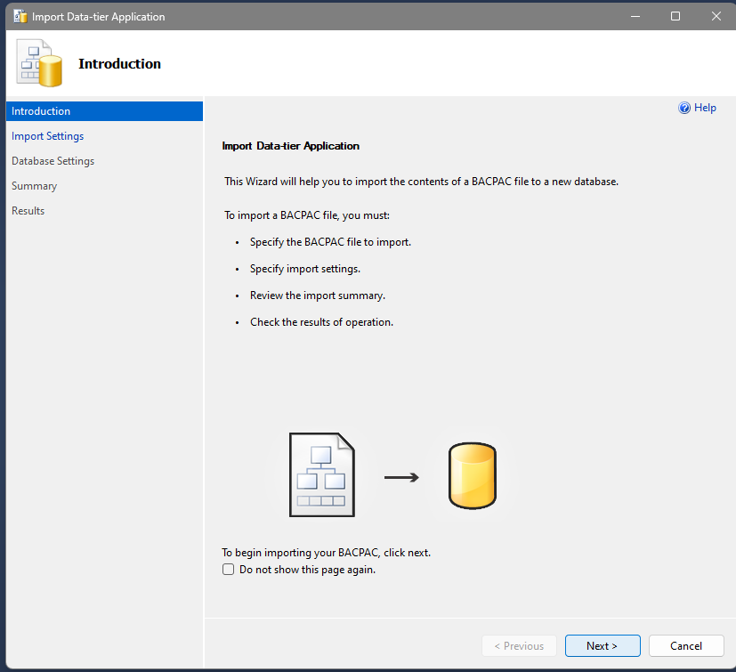
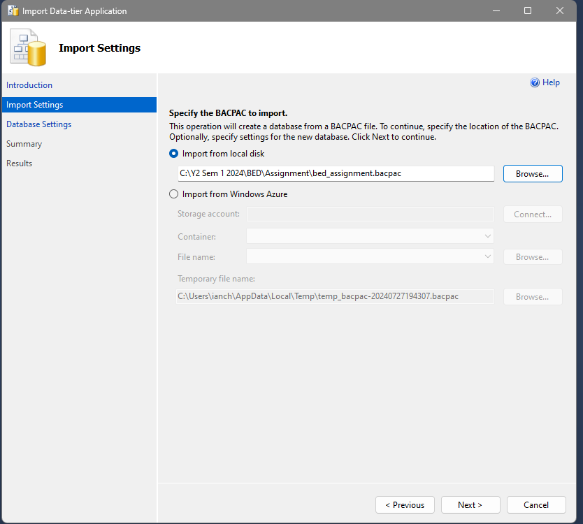
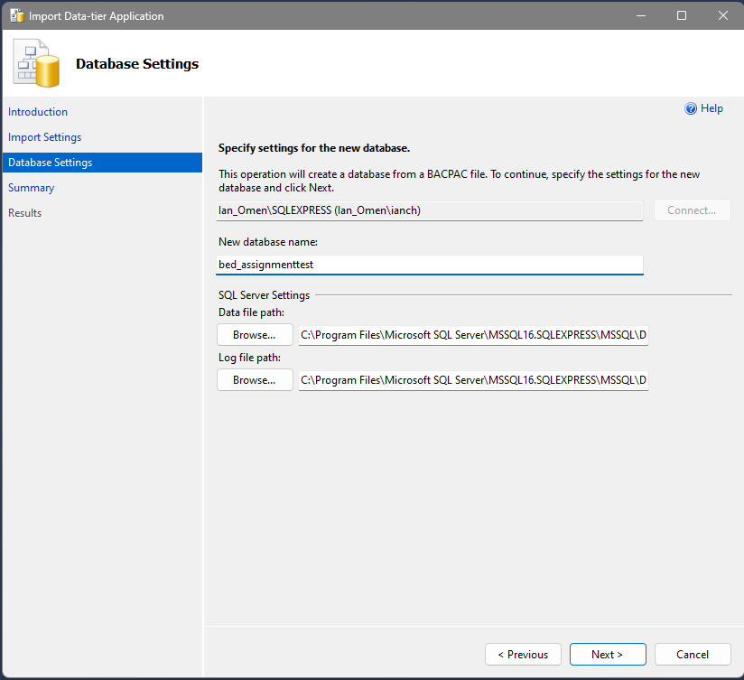
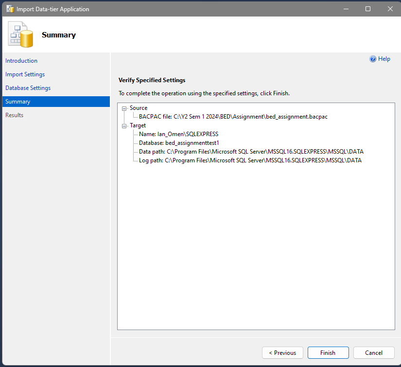

# (BED Assignment 2024 | P04 | T6)  A+4BED: Industrial Relevance Website

## Team Members:
- Lim Weiqin Ian
- Chong Yun Ze
- Daniel Sha
- Dallas Chan Yuan Sheng 

## Introduction to the App
Application’s Theme: **Industrial Relevance**   
Introducing A+4BED, your one-stop solution for staying updated on industrial relevance across various sectors. Our platform offers a wide array of features designed to enhance user engagement and provide comprehensive information on the latest trends, events, and discussions in the industrial sector. Whether you're a professional looking to stay informed or an enthusiast eager to learn more, A+4BED has something for everyone.

## Function-In-Charge

| Functions-In-Charge                                                                                     | Name   |
|:--------------------------------------------------------------------------------------------------------|:-------|
| Comment Section for Articles & Events for users to create comments to communicate with each other       | Ian    |
| Comment Section Filtering by either latest, or relevancy (by comment-score)                             | Ian    |
| Reply comments with indentations from parent Comment                                                    | Ian    |
| Users can delete or edit their comments                                                                 | Ian    |
| Have an insightful chat with a Chatbot regarding industrial relevance                                   | Ian    |
| Create multiple chat conversations/instances and rename these chat conversations to keep things organized | Ian    |
| Login for Users and Admins                                                                              | Daniel |
| Sign up for Users                                                                                       | Daniel |
| Profile section for Users and Admins                                                                    | Daniel |
| About section for Users                                                                                 | Daniel |
| Creation, deletion and updating of user and admin accounts that can only be done by admins              | Daniel |
| Viewing of all accounts registered to the website                                                       | Daniel |
| Searching of account                                                                                    | Daniel |
| Viewing all articles                                                                                    | Yun Ze |
| Favouriting articles and viewing favourites                                                             | Yun Ze |
| Creating blogs and viewing created blogs                                                                | Yun Ze |
| Edit and Delete created blogs                                                                           | Yun Ze |
| Events page for company accounts to create events                                                       | Dallas |
| Events page for non logged in or normal users to view events                                            | Dallas |
| Specific event details page for users to see detailed info about events and allowing normal users to sign up for them. | Dallas |
| Refresh Token to allow users to stay logged in longer while having security.                            | Dallas |
| My Events page for normal users to see the events they have signed up for and leave any events that they have signed up for  | Dallas |
| My events page for company users to kick normal attendees that signed up for their event or to delete an event they have created. | Dallas  |
| Game page for normal users and company users that are logged in to play a game, save game files and view highscores. | Dallas  |

## Importing the SQL Database with .bacpac file

### Step 1: Download the .bacpac File
1. Download the file called **"bed_assignment.bacpac"** from your provided source and save it to a known location on your computer.

### Step 2: Open SQL Server Management Studio
1. Open SQL Server Management Studio and connect to your server.
2. Right-click on `Databases` and select `Import Data-tier Application`.

### Step 3: Import the .bacpac File
1. In the wizard, select `Next`

### Step 4: Import the .bacpac File
1. Browse to the .bacpac file location where you saved.

### Step 5: Import the .bacpac File
1. Make sure the database name is bed_assignment

### Step 6: Import the .bacpac File
1. Click 'Finish' button on the bottom right

## Starting the Project
To start the project, you must use the following commands after going to the directory "BED_Assignment":

npm install
npm start

## Sign Up for a Company Email to Post an Event
When signing up for a company email to post an event, use the following for the PayPal email:
- **PayPal Email for Company:** `sb-janes31221073@business.example.com`

## Paying for an Event as a Normal User
When paying for an event as a normal user, use the following email and credentials:
- **Email:** `sb-e43b1j31226551@personal.example.com`
- **Password:** `Z&9k'Bh1`

