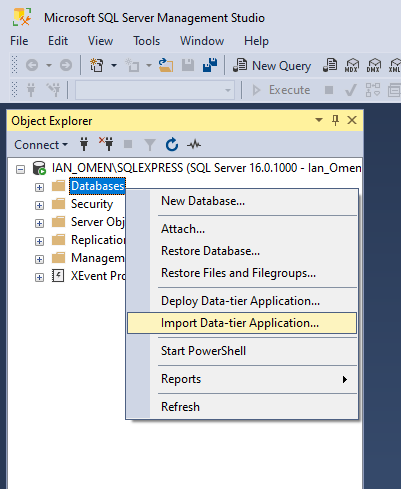
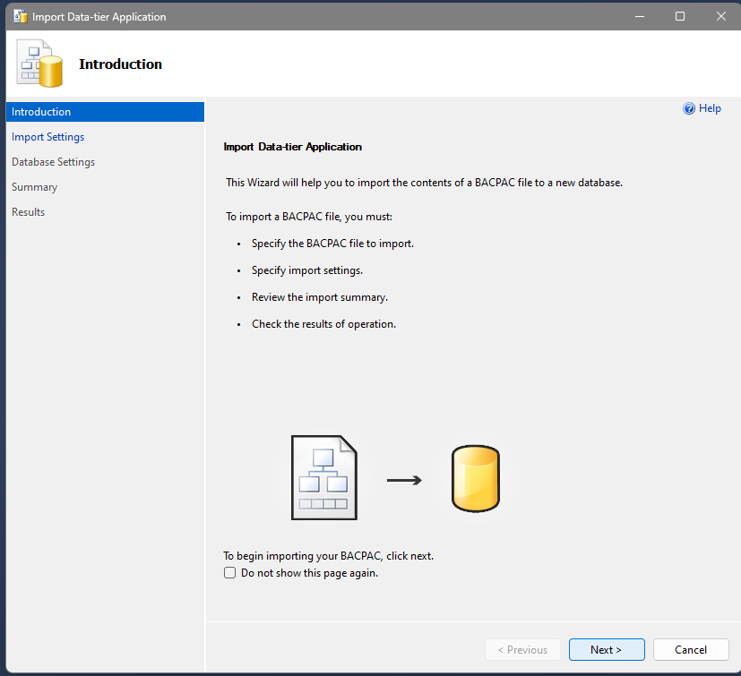
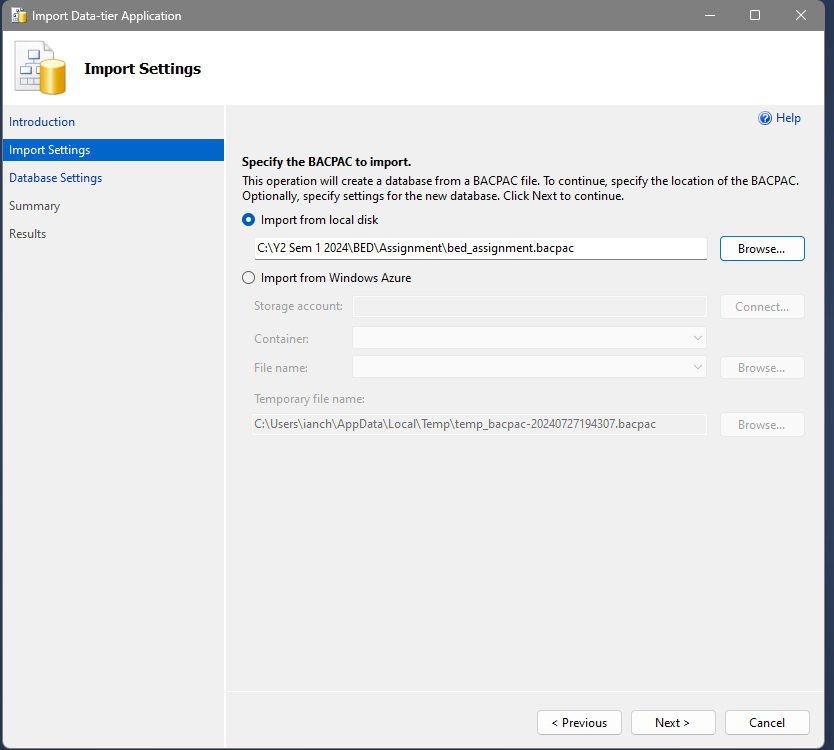

# (BED Assignment 2024 | P04 | T6)
# A+4BED: Industrial Relevance Website

## Team Members:
- Lim Weiqin Ian
- Chong Yun Ze
- Daniel Sha
- Dallas Chan Yuan Sheng 

## Introduction to the App
Application’s Theme: **Industrial Relevance**   
Introducing A+4BED, your...

## Function-In-Charge

| Functions-In-Charge                                                       | Name     |
|:--------------------------------------------------------------------------|:---------|
| Comment Section for Articles & Events                                     | Ian      |
| Comment Section Filtering                                                 | Ian      |
| ChatBot Conversation Regarding Industrial Relevance                       | Ian      |
| Login for Users and Admins                                                | Daniel   |
| Login for Users and Admins                                                | Daniel   |
| Sign up for Users                                                         | Daniel   |
| Profile section for Users and Admins                                      | Daniel   |
| About section for Users                                                   | Daniel   |
| Creation, deletion and updating of user and admin accounts that can only be done by admins | Daniel |
| Viewing of all accounts registered to the website                         | Daniel   |
| Searching of account                                                      | Daniel   |
| Viewing all articles                                                      | Yun Ze   |
| Favouriting articles and viewing favourites                               | Yun Ze   |
| Creating blogs and viewing created blogs                                  | Yun Ze   |
| Edit and Delete created blogs                                             | Yun Ze   |
| Viewing Events                                                            | Dallas   |
| Edit and Delete created blogs                                             | Dallas   |
| Edit and Delete created blogs                                             | Dallas   |
| Edit and Delete created blogs                                             | Dallas   |

## Importing the SQL Database with .bacpac file

### Step 1: Open SQL Server Management Studio
1. Open SQL Server Management Studio and connect to your server.
2. Right-click on `Databases` and select `Import Data-tier Application`.

### Step 2: Import the .bacpac File
3. In the wizard, select `Next`

### Step 3: Import the .bacpac File
4. Browse to the .bacpac file location where you saved.

### Step 4: Import the .bacpac File
5. Make sure the database name is bed_assignment

### Step 5: Import the .bacpac File
6. Click 'Finish' button on the bottom right

## Starting the Project
To start the project, you must use the following commands after going to the directory "BED_Assignment":

npm install
npm start

## Sign Up for a Company Email to Post an Event
When signing up for a company email to post an event, use the following for the PayPal email:
- **PayPal Email for Company:** `sb-janes31221073@business.example.com`

## Paying for an Event as a Normal User
When paying for an event as a normal user, use the following email and credentials:
- **Email:** `sb-e43b1j31226551@personal.example.com`
- **Password:** `Z&9k'Bh1`

